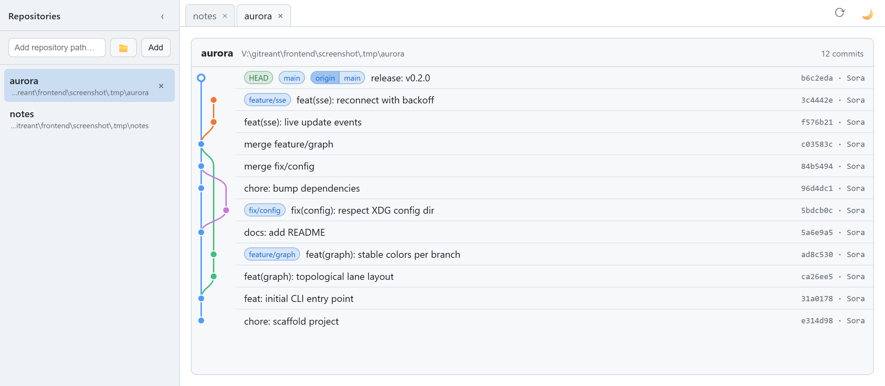

# gitreant

[](https://deepwiki.com/ShortArrow/gitreant)
[](https://crates.io/crates/gitreant)

<!-- [](https://github.com/ShortArrow/gitreant/releases) -->

[English](README.md) | [日本語](docs/README.jp.md)

Manage, inspect, and maintain multiple Git repositories from one place.

Gitreant combines “Git” with “Treant,” a mythical guardian of the forest. The name represents a tool that watches over, organizes, and maintains a forest of Git repositories.

Pronunciation: /ˈɡɪt.triːənt/ (git-ree-ant)

A web app that shows commit graphs of local git repositories side by side in a
single-page app. Inspired by [k1LoW/mo](https://github.com/k1LoW/mo), it ships
as a single Rust binary with an embedded React SPA.

<picture>
  <source media="(prefers-color-scheme: dark)" srcset="docs/images/screenshot-dark.png">
  
</picture>

```console
$ gitreant                 # discover .git from the current directory
$ gitreant ../foo ../bar   # show multiple repositories at once
```

Running `gitreant` again from another directory adds that repository to the
already-running server, so everything appears on the same page
(single-instance behavior, like mo).

The launcher detaches by default: the server keeps running in the background
and control returns to your shell. Stop it with `gitreant --shutdown`, or use
`--foreground` to keep the server attached to the terminal.

## Features

- Commit graph rendering with lanes and colors computed server-side;
  merge-commit messages are dimmed, and clicking a hash copies the full id.
  Hovering a graph node shows its hash; clicking it selects the commit
- Right-click a branch badge to copy its name, check it out, or merge it
  into the current branch (server-side `git switch` / `git merge`);
  right-click a commit row or its graph node to tag it, or a tag badge to
  delete the tag.
  Tags, the stash and branches render as distinct badges
- Click a commit to see its full message, signature state (with the signing
  key id, click to copy), and changed files (flat or tree view) with line
  counts; click a file (or "Diff all") to see diffs inline or side-by-side,
  with intra-line changes highlighted. The author links to their GitHub
  profile and their address copies; so do the parent ids, and a file's
  right-click menu copies its relative or absolute path
- Select diff lines via the line-number gutter (shift-click for ranges) to
  copy them or a GitHub permalink
- Fetch button runs `git fetch` for every shown repository (requires git);
  a toggleable bottom pane logs the executed commands and your UI actions
- Signed commits carry a badge in the graph: Verified / Unverified when a
  local gpg can check the signature, plain Signed otherwise
- Branch badges carry a GitHub mark linking to their open pull request when
  the `gh` CLI is installed and authenticated; squash-merged branches that
  still exist get a dashed link to the commit their PR landed as
- Multiple repositories in one SPA: a drawer to list/add/remove, tabs to switch
- Live updates via Server-Sent Events when repositories are added or removed,
  plus a reload button to pick up new commits
- Native folder picker for adding repositories
- Detaches from the terminal by default; `--shutdown` stops the server
- A command palette (Ctrl+K / Cmd+K) for switching repositories and
  running fetch, reload, theme and other actions from the keyboard
- Dark/light theme toggle, and a settings dialog for the UI language
  (auto / English / Japanese), the timestamp format (ISO / locale /
  relative), and for rendering action buttons as icons, icons with labels,
  or labels only
- Single self-contained binary — no runtime dependencies

## Install / Build

Requirements: Rust (stable), Node.js + pnpm.

```console
$ make build     # build the frontend and embed it into a release binary
$ ./target/release/gitreant
```

## Options

```
gitreant [PATH...]
  -p, --port <PORT>   port to listen on / connect to (default 4000)
      --no-open       do not open the browser automatically
      --app           open in a chromeless window instead of a tab (needs a
                      Chromium-based browser; falls back to the ordinary
                      browser without one, and --no-open outranks it)
      --foreground    run the server in the current terminal instead of detaching
      --shutdown      stop the running gitreant server and exit

gitreant doctor       check the environment: git (required), gh and gpg
                      (optional feature enablers), and whether a server is
                      already running on the port; exits non-zero when a
                      required tool is missing
gitreant restart      restart the running server, keeping the repositories it
                      shows; a fresh process re-verifies every signature and
                      picks up a rebuilt binary
gitreant refresh      re-verify commit signatures in place, without restarting
                      (use after adding a key to your gpg keyring)
```

## Contributing

See [docs/CONTRIBUTING.md](docs/CONTRIBUTING.md) for development setup,
architecture, and testing. Planned work lives in
[docs/ROADMAP.md](docs/ROADMAP.md).

## License

Licensed under either of the following, at your option:

- MIT License ([LICENSE-MIT](LICENSE-MIT))
- Apache License 2.0 ([LICENSE-APACHE](LICENSE-APACHE))

`SPDX-License-Identifier: MIT OR Apache-2.0`

Unless you explicitly state otherwise, any contribution intentionally
submitted for inclusion in this work by you, as defined in the Apache-2.0
license, shall be dual licensed as above, without any additional terms or
conditions.
